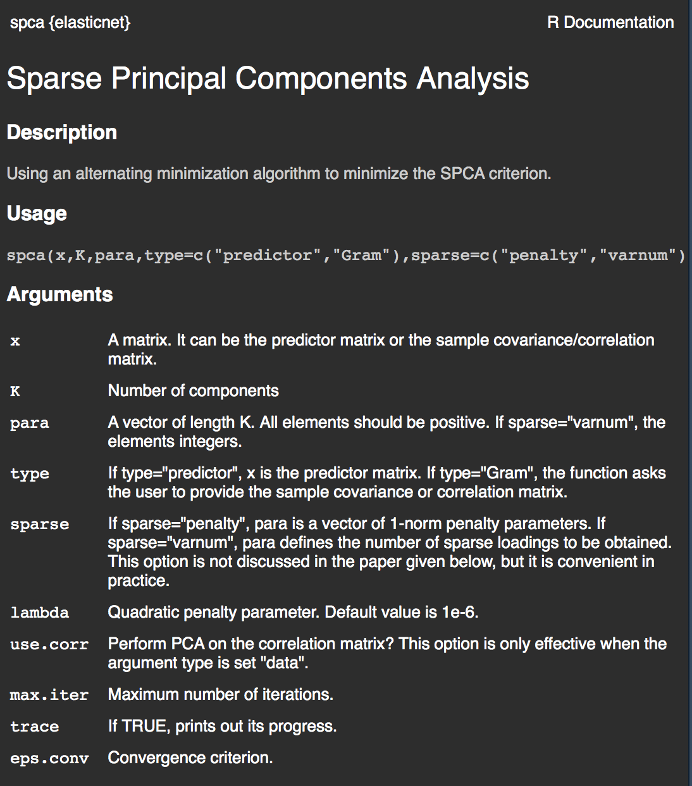

```{r setup, include=FALSE}
knitr::opts_chunk$set(echo = FALSE, warning = FALSE, message = FALSE)
```

## Contenu

- Introduction du concept
- Exemple de motivation
- Description de la méthodologie
- Exemple d'application
- Autres implications


## Réduction de la dimensionnalité

Les techniques de réduction de la dimensionnalité ont comme objectifs de réduire le nombre de variables observées dans le but de:

- Simplifier l'interprétation de données
- Visualiser les données
- Améliorer la performance de d'autres méthodes

## L'ACP

L'analyse en composantes principales est méthode classique de réduction de la dimensionnalité.

**Objectif**

Obtenir une représentation des données dans un espace plus restreint en conservant la plus grande quantité d'information possible.

- On crée des combinaisons linéaires des $p$ variables
- On maximise la variance à chacune des composantes

## Notation

Soit le jeu de données représenté par:

$\mathbf{X} = (X_1, ..., X_p)^\top$

avec une matrice de covariance $\Sigma = \text{var}(\mathbf{X})$.

La première composante principale est donnée par:

$Y_1 = \alpha^{\top}_{1}\mathbf{X}$

qui maximise $\text{var}(Y_1) = \lambda_1$.

## Décomposition en valeurs singulières

Ce problème d'optimisation peut être résoud plus aisément avec une décomposition en valeurs singulières (SVD) de la matrice $\Sigma$.

- Les vecteurs $\alpha_1, ..., \alpha_p$ sont donnés par les vecteurs propres normés.
- Les variances $\lambda_1, ..., \lambda_p$ pour chacune des composantes principales sont données par les valeurs propres. 

## Le résultat de l'ACP

On peut utiliser le résultat de la décomposition en valeurs singulières pour analyser deux choses:

1. L'importance relative de chacune des variables dans chacune des composantes principales via les vecteurs de coefficients de saturation ($\alpha_1, ..., \alpha_p$).
2. La quantité d'information contenue dans chacune des composantes principales via les valeurs propres ($\lambda_1, ..., \lambda_p$).

## L'interprétation de l'ACP

Voici les vecteurs de coefficients de saturation pour les $4$ premières composantes principales du jeu de données $\texttt{decathlon}$ de la librarie **FactoMineR**.

```{r acp_deca, size="small"}
library(FactoMineR)
data("decathlon")
data_decathlon <- decathlon[,1:10]
acp <- prcomp(x = cor(data_decathlon), center = FALSE)
acp$rotation[, 1:4]
```

## Les inconvéniants de l'ACP

Voici les vecteurs de coefficients de saturation pour les $4$ premières composantes principales du jeu de données $\texttt{pitprops}$ de la librarie **elasticnet**.

```{r acp_pitprops, size="small"}
library(elasticnet)
data("pitprops")
acp_pit <- prcomp(x = pitprops, center = FALSE)
acp_pit$rotation[, 1:4]
```

## Les méthodes d'interprétation

Plusieurs méthodes existent pour palier au problème d'interprétation:

- Les rotations (varimax, promax, etc)
- Écart les coefficients inférieurs à une certaine valeur
- Limiter les valeurs possibles que les coefficients peuvent prendre (ex: $\{-1,0,1\}$)

## Rotation varimax

La rotation varimax est une rotation orthogonale classique est bien souvent implémentée par défaut dans les logiciels.

```{r rotation}
library(psych)
acp_rotated <- principal(pitprops, 6, rotate = "varimax", eps = 1e-14)
acp_rotated$loadings[, 1:4]
```

## Variance dans les premières composantes principales

Voici la quantité d'information (variance) pour les 6 premières composantes principales:

```{r var}
library(data.table)

data_var_acp <- data.table(
  mesure = c("Variance (%)", "Variance cumulative (%)"),
  PC1 = round(c(100*acp_pit$sdev[1]/sum(acp_pit$sdev), 100*cumsum(acp_pit$sdev)[1]/sum(acp_pit$sdev)), 2),
  PC2 = round(c(100*acp_pit$sdev[2]/sum(acp_pit$sdev), 100*cumsum(acp_pit$sdev)[2]/sum(acp_pit$sdev)), 2),
  PC3 = round(c(100*acp_pit$sdev[3]/sum(acp_pit$sdev), 100*cumsum(acp_pit$sdev)[3]/sum(acp_pit$sdev)), 2),
  PC4 = round(c(100*acp_pit$sdev[4]/sum(acp_pit$sdev), 100*cumsum(acp_pit$sdev)[4]/sum(acp_pit$sdev)), 2),
  PC5 = round(c(100*acp_pit$sdev[5]/sum(acp_pit$sdev), 100*cumsum(acp_pit$sdev)[5]/sum(acp_pit$sdev)), 2),
  PC6 = round(c(100*acp_pit$sdev[6]/sum(acp_pit$sdev), 100*cumsum(acp_pit$sdev)[6]/sum(acp_pit$sdev)), 2)
)

data_var_rot <- data.table(
  mesure = c("Variance (%)", "Variance cumulative (%)"),
  PC1 = 100*c(0.28, 0.28),
  PC2 = 100*c(0.15, 0.43),
  PC3 = 100*c(0.12, 0.56),
  PC6 = 100*c(0.12, 0.67),
  PC5 = 100*c(0.11, 0.78),
  PC4 = 100*c(0.09, 0.87)
)

data_var_acp
data_var_rot
```

## Les inconvéniants

Plusieurs désavantages peuvent survenir avec ce type de méthode:

- Instabilité dans les interprétations.
- Perte d'information dans les premières composantes principales.

## L'ACP parcimonieuse

Les méthodes introduites dans cette présentation permettront de combiner en **une seule étape** l'ACP avec les autres méthodes d'interprétation.

- Améliorer l'interprétation en obtenant des coefficients de saturation excatement égales à 0.
- Maximiser la quantitié d'information contenue dans chacune des composantes principales en tenant compte de certaines contraintes d'interprétabilité.

## Description de la méthodologie

## Justification de la méthodologie

## Jeu de données pitprops

Revenons au jeu de données `pitprops` introduit en début de la présentation et appliquons l'analyse en composante principale parcimonieuse.

- Méthode: SPCA
- Librairie: **elasticnet**
- Fonction: *spca*

## Fonction *spca*



## Définir nos paramètres

Voici les paramètres choisis pour l'exemple `pitprops` et l'application de la fonction *spca*.

$$
  \lambda=0.000001 \\
  \lambda_1= [0.06, 0.16, 0.1, 0.5, 0.5, 0.5]
$$
```{r spca, echo = TRUE}
lambda <- 0.000001
lambda_1 <- c(0.06, 0.16, 0.1, 0.5, 0.5, 0.5)

spca_pitprops <- spca(pitprops, 
                      K = 6, 
                      type = "Gram", 
                      sparse = "penalty",
                      para = lambda_1, 
                      lambda = lambda)
```

## Résultat de l'ACP parcimonieuse

```{r spca_loadings, echo = TRUE}
spca_pitprops$loadings
```

## Comparaison pour la 1er composante

Voici les vecteurs de coefficients de saturation pour la 1er composante principale ($\alpha_1$) pour les $3$ différentes méthodes.

```{r comp_1_composante}
data.table(
  PCA = acp_pit$rotation[, 1],
  RPCA = acp_rotated$loadings[, 1],
  SPCA = spca_pitprops$loadings[, 1]
)
```

## Coefficients tirés vers 0

```{r graph_coeff, fig.align='center'}
library(dplyr)
library(ggplot2)

data.table(
  PC = rep(as.character(seq(1:6)), 3),
  methode = c(rep("SPCA", 6), rep("RPCA", 6), rep("PCA", 6)),
  nb_nuls = c(sapply(1:6, function(x) sum(spca_pitprops$loadings[,x] == 0)), sapply(1:6, function(x) sum(abs(acp_rotated$loadings[,x]) <= 0.3)), sapply(1:6, function(x) sum(abs(acp_pit$rotation[,x]) <= 0.3)))
) %>% 
  ggplot(aes(x = PC, y = nb_nuls, group = methode, color = methode)) +
    geom_point() +
    geom_line() +
    scale_x_discrete("Composante principale") +
    scale_y_continuous("Nombre de coefficents nuls ou plus petit que 0.2", breaks = seq(0,12)) +
    scale_color_discrete("Méthode") +
    coord_cartesian(ylim = c(0,13)) +
    theme_classic()
```

## Autres implications

Il existe une autre méthode connue que nous n'avons pas touchée dans cette présentation. Il s'agit de la méthode PMD.

- Basée sur la décomposition pénalisée de la matrice de covariance (ou corrélation).
- On peut retrouver une implémentation de cette méthode en **R** dans la librairie **PMA**.

## Références

- ESL section 14.5.5
- Jolliffe, Ian T., Nickolay T. Trendafilov, and Mudassir Uddin. ”A modified principal com-
ponent technique based on the LASSO.” Journal of Computational and Graphical Statistics
12.3 (2003) : 531-547.
- Witten, Daniela M., Robert Tibshirani, and Trevor Hastie. ”A penalized matrix decomposi-
tion, with applications to sparse principal components and canonical correlation analysis.” Biostatistics 10.3 (2009) : 515-534.

